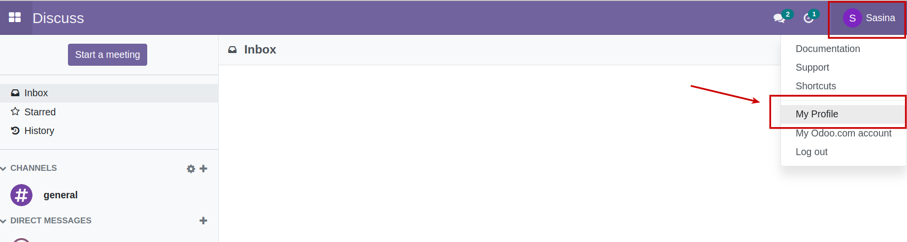
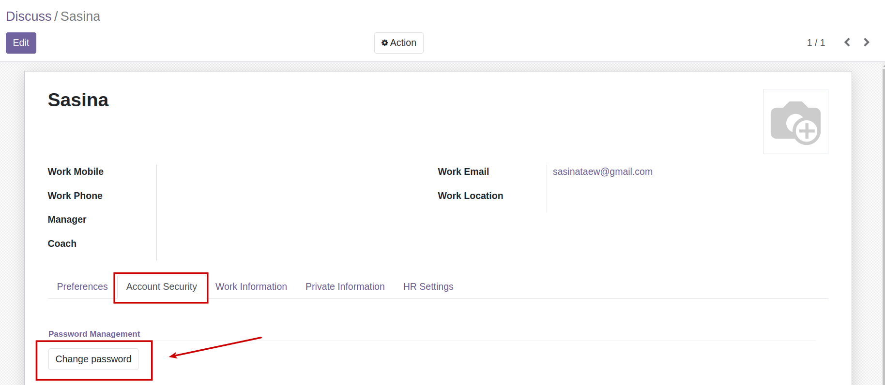
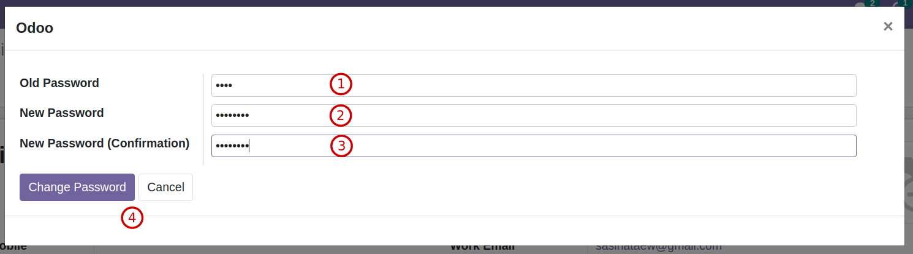

# การเปลี่ยนรหัสผ่าน

เมื่อผู้ใช้งานต้องการเปลี่ยนแปลงรหัสผ่าน สามารถกำหนดรหัสผ่านใหม่ได้เอง โดยมีขั้นตอนดังนี้

กดที่ชื่อผู้ใช้งาน และเลือกเมนู My Profile

 
ที่แท็บ Account Security คลิกปุ่ม Change Password เพื่อเปลียนรหัสผ่าน

กรอกข้อมูลรหัสผ่าน

  * (1) Old Password: กรอกรหัสผ่านเดิม

  * (2) New Password: กรอกรหัสผ่านใหม่

  * (3) New Password (Confirmation) กรอกรหัสผ่านใหม่อีกครั้งเพื่อยืนยัน

  * (4) เลือกดำเนินการ
        
     * กดปุ่ม Change Password เพื่อยืนยันการเปลี่ยนรหัสผ่าน ผู้ใช้งานจะถูกออกจากระบบโดยอัตโนมัติ เพื่อล็อคอินเข้าสู่ระบบด้วยรหัสผ่านใหม่

     * กดปุ่ม Cancel เพื่อยกเลิกการเปลี่ยนรหัสผ่าน

เมื่อยืนยันการเปลี่ยนรหัสผ่านแล้ว บัญชีผู้ใช้งานจะออกจากระบบให้อัตโนมัติ สามารถเข้าสู่ระบบอีกครั้งด้วยรหัสผ่านใหม่

---

