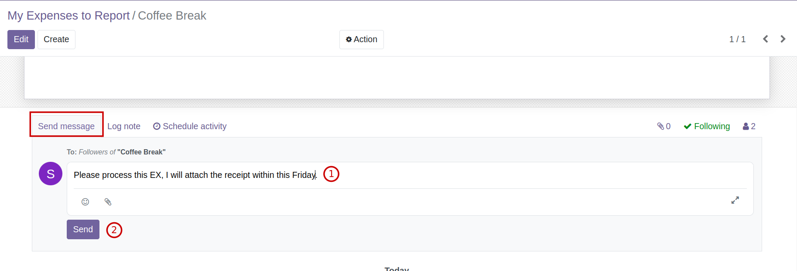
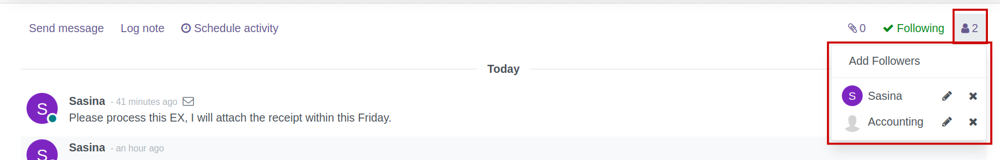
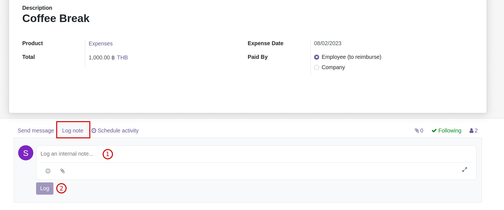
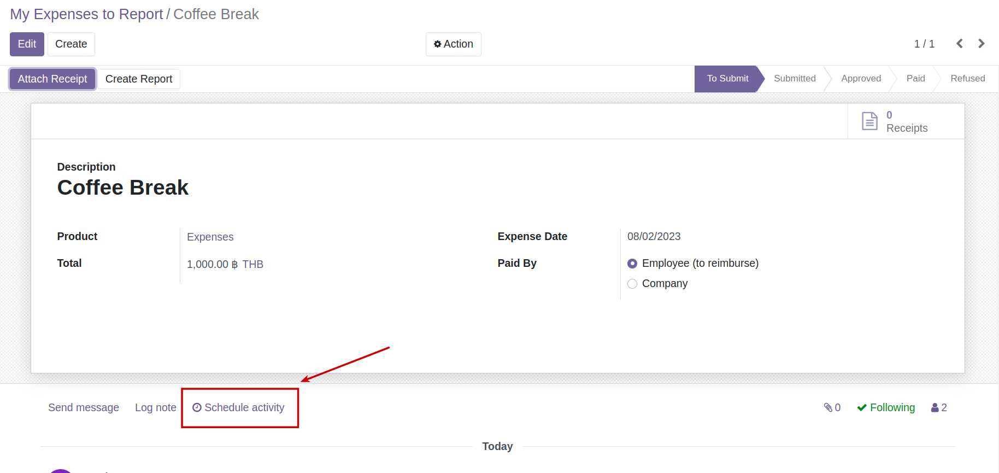
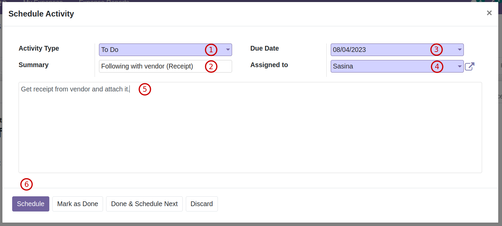
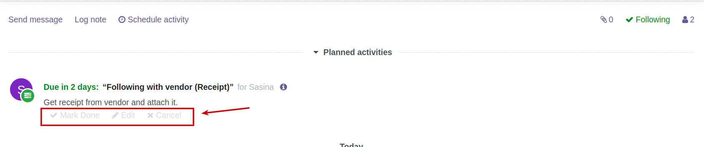
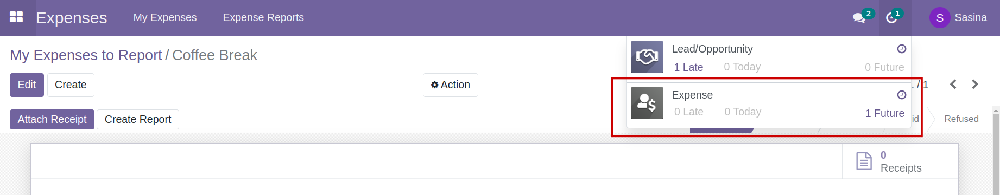

# การสื่อสารผ่านระบบ

## การส่งข้อความในระบบ (Send Message)

ที่ด้านล่างของหน้าเอกสาร จะมีปุ่ม Send Message ใช้สำหรับส่งข้อความและไฟล์แนบ ถึงผู้เกี่ยวข้องของเอกสารนี้ทางอีเมล สามารถ Send message ได้โดย

กดที่ Send message

    
* (1) ระบุข้อความทีต้องการส่ง สามารถแนบไฟล์ที่เกี่ยวข้องได้โดยกดที่รูปคลิปหนีบกระดาษ  
* (2) กดปุ่ม Send เพื่อยืนยันการส่งข้อความ

!!!Note 
    สามารถดู/เพิ่ม/ลด ผู้เกี่ยวข้องของเอกสารนั้นๆได้ โดยกดที่รูปคนด้านขวามือ (ทั้งนี้การเข้าถึงหน้าเอกสารนี้ ขึ้นอยู่กับสิทธิ์ของผู้ใช้งานแต่ละคน)
    

!!!Note 
    Send message เป็นการส่งออกข้อความให้ผู้เกี่ยวข้องทางอีเมล ต้องมีการตั้งค่า Outgoing Email โดยผู้ดูแลระบบก่อน จึงจะสามารถส่งข้อความไปถึงอีเมลผู้เกี่ยวข้องได้

---

## การบันทึกข้อมูลการดำเนินงาน (Log note)

ที่ด้านล่างของหน้าเอกสาร จะมีปุ่ม Log note ใช้สำหรับบันทึกข้อความที่เอกสารนั้นๆ ผู้ที่มีสิทธิ์เข้าถึงเอกสารก็จะสามารถเห็นข้อความได้ สามารถเพิ่ม Log note ได้โดย

กดที่ Log note

* (1) ระบุข้อความทีต้องการจดบันทึก สามารถแนบไฟล์ที่เกี่ยวข้องได้โดยกดที่รูปคลิปหนีบกระดาษ 
* (2) กดปุ่ม Log เพื่อยืนยันการจดบันทึกข้อความ

!!!Note 
    สามารถดู/เพิ่ม/ลด ผู้เกี่ยวข้องของเอกสารนั้นๆได้ โดยกดที่รูปคนด้านขวามือ (ทั้งนี้การเข้าถึงหน้าเอกสารนี้ ขึ้นอยู่กับสิทธิ์ของผู้ใช้งานแต่ละคน)
    

---

## การสร้างรายการแจ้งเตือนการทำงาน (Schedule Activities)

ที่ด้านล่างของหน้าเอกสาร จะมีปุ่ม Schedule Activity ใช้สำหรับแจ้งเตือนการทำงานสำหรับตัวเองหรือผู้ใช้งานอื่น

เมื่อกดที่ปุ่ม Schedule Activity ระบบจะแสดงหน้าต่าง เพื่อกรอกข้อมูลดังนี้

* (1) Activity Type: เลือกสิ่งที่ต้องทำ
* (2) Summary: กรอกข้อมูลสรุปสิ่งที่ต้องทำ
* (3) Due Date: เลือกกำหนดเวลา
* (4) Assigned to: เลือกผู้ใช้งานที่ต้องการมอบหมายงานหรือแจ้งเตือน
* (5) กรอกรายละเอียด
* (6) เลือกการกระทำ
    * Schedule: ยืนยันการตั้งค่ากำหนดการ
    * Mark as Done: ทำเครื่องหมายว่าเสร็จแล้ว
    * Done & Schedule Next: เสร็จแล้วและสร้าง Schedule Activity ใหม่
    * Discard: ยกเลิกการตั้งค่ากำหนดการ

เมื่อตั้งค่า Schedule Activity แล้ว จะแสดงที่ด้านล่างของเอกสาร ผู้ได้รับมอบหมายสามารถ

    
* กด Mark Done เมื่อดำเนินการเสร็จสิ้น
* กด Edit เพื่อแก้ไขรายละเอียด
* กด Cancel เมื่อต้องการยกเลิกกิจกรรมนี้

หลังจากตั้งค่า Schedule Activity แล้ว เมื่อ ผู้ใช้งานที่ได้รับมอบหมายงานหรือแจ้งเตือนเข้าสู่ระบบ ที่ไอคอนรูปนาฬิกา จะมีรายการที่ต้องทำแสดงไว้ โดยแบ่งรายการที่ต้องทำด้วย Due date

   * Late: เกินกำหนดเวลา
   * Today: ถึงกำหนดในวันนี้
   * Future: ยังไม่ถึงกำหนดเวลา

---

